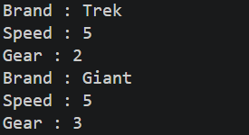
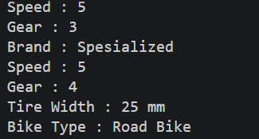
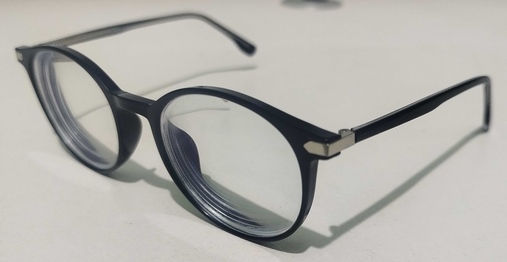
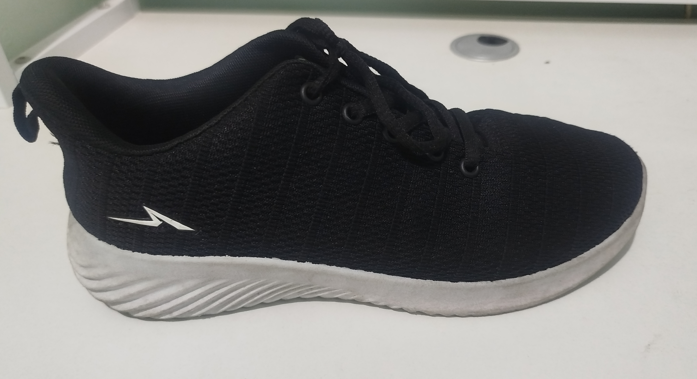
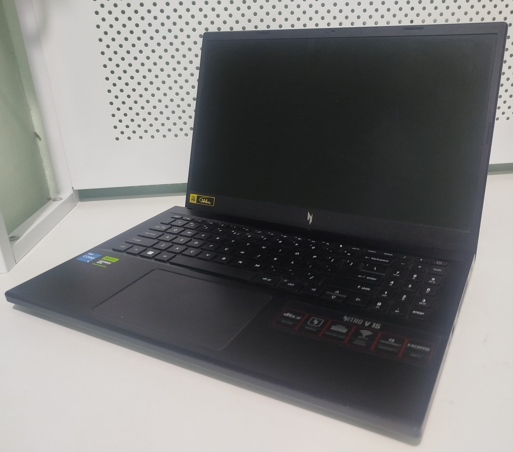

|            | Praktikum Pemrograman Berbasis Objek                                               |
| ---------- | ---------------------------------------------------------------------------------- |
| NIM        | 254107020130                                                                       |
| Nama       | Achmad Pradita Dwi Firmansyah                                                      |
| Kelas      | TI - 2G                                                                            |
| Repository | [link] (https://github.com/praditadf/PraktikumPemrogramanBerbasisObjek/tree/main/jobsheet01) |

# Percobaan

## Percobaan 1

**Class Bike**

```
package jobsheet01;
public class Bike {
    private String brand;
    private int speed;
    private int gear = 1;
    // Gear 1: max 5 km/h, Gear 2: mac 10 km/h, ... Gear 6: max 60 km/h
    private final int[] GEAR_SPEED_LIMITS = { 5, 10, 25, 30, 40, 60 };

    void setBrand(String brandName) {
        brand = brandName;
    }

    void gearChanges(int gearValue) {
        if (gearValue < 1 || gearValue > 6) {
            System.out.println("Invalid gear value. Gear must be beetween 1 and 6.");
        } else {
            gear = gearValue;
        }
    }

    int speedAcceleration(int increment) {
        speed += increment;
        if (speed > GEAR_SPEED_LIMITS[gear - 1]) {
            speed = GEAR_SPEED_LIMITS[gear - 1];
        }
        return speed;
    }
    int speedDeceleration(int decrement) {
        speed -= decrement;
        if (speed < 0) {
            speed = 0;
        }
        return speed;
    }

    void printInfo(){
        System.out.println("Brand : " + brand);
        System.out.println("Speed : " + speed);
        System.out.println("Gear : " + gear);
    }
}
```

**Class BikeDemo**

```
package jobsheet01;

public class BikeDemo {
    public static void main(String[] args) {
        Bike mountainBike1 = new Bike();
        Bike mountainBike2 = new Bike();

        mountainBike1.setBrand("Trek");
        mountainBike1.speedAcceleration(10);
        mountainBike1.gearChanges(2);
        mountainBike1.printInfo();

        mountainBike2.setBrand("Giant");
        mountainBike2.speedAcceleration(20);
        mountainBike2.gearChanges(3);
        mountainBike2.printInfo();
    }
}
```



## Percobaan 2

**Class RoadBike**

```
package jobsheet01;

public class RoadBike extends Bike{
    private int tireWidth;

    void setTireWidth(int width) {
        tireWidth = width;
    }

    @Override
    void printInfo() {
        super.printInfo();
        System.out.println("Tire Width : " + tireWidth + " mm");
        System.out.println("Bike Type : Road Bike ");
    }

}
```

**Class BikeDemo**

```
package jobsheet01;

public class BikeDemo {
    public static void main(String[] args) {
        Bike mountainBike1 = new Bike();
        Bike mountainBike2 = new Bike();
        RoadBike roadBike1 = new RoadBike();

        mountainBike1.setBrand("Trek");
        mountainBike1.speedAcceleration(10);
        mountainBike1.gearChanges(2);
        mountainBike1.printInfo();

        mountainBike2.setBrand("Giant");
        mountainBike2.speedAcceleration(20);
        mountainBike2.gearChanges(3);
        mountainBike2.printInfo();

        roadBike1.setBrand("Spesialized");
        roadBike1.setTireWidth(25);
        roadBike1.speedAcceleration(15);
        roadBike1.gearChanges(4);
        roadBike1.printInfo();
    }
}
```



**Pertanyaan**

1. Jelaskan perbedaan antara object dengan class!

```
* Object : Masih berupa rancangan/ template/ desain/ blueprint
* Class  : Objek nyata yang sudah dibentuk dari suatu class
```

2. Jelaskan alasan gear dan brand dapat menjadi atribut dari object Bike!

```
Gear dan brand menjadi atribut dari object Bike karena gear dan brand merupakan state yang dimiliki oleh sepeda.
```

3. Sebutkan salah satu kelebihan utama dari pemrograman berorientasi objek dibandingkan dengan pemrograman prosedural!

```
Pemograman berorientasi objek lebih efisien karena hanya perlu membuat objek saja tidak perlu berulang ulang membuat variabel jika terdapat objek yang sama.
```

4. Apakah diperbolehkan melakukan pendefinisian dua buah atribut dalam satu baris kode seperti “public String nama, alamat;”?

```
Pendefinisian dua buah atribut dalam saru baris kode diperbolehkan jika kedua atribut tersebut memiliki tipe data yang sama
```

5. Pada class RoadBike, jelaskan alasan atribut brand, speed, dan gear tidak lagi ditulis di dalam class tersebut!

```
Atribut brand, speed, dan gear tidak lagi ditulis di dalam class RoadBike karena class RoadBike merupakan turunan dari class bike melalui konsep pewarisan dimana atribut dan method milik class bike akan otomatis diturunkan ke class RoadBike.
```

# Praktikum

*4 Object*






**Class Hp**

```
package jobsheet01;

public class Hp {
    private String brand;
    private int storage;
    private int ram;
    private String processor;

    void setBrand(String brandName) {
        brand = brandName;
    }

    void setStorage(int totalStorage) {
        storage = totalStorage;
    }

    void setRam(int totalRam) {
        ram = totalRam;
    }

    void setProcessor(String processorName) {
        processor = processorName;
    }

    void printInfo() {
        System.out.println("Brand : " + brand);
        System.out.println("Storage : " + storage + " GB");
        System.out.println("Ram : " + ram + " GB");
        System.out.println("Processor : " + processor);
    }
}
```

**Class Kacamata**

```
package jobsheet01;

public class Kacamata {
    private String brand, color;
    private int size;

    void setBrand(String brandName) {
        brand = brandName;
    }

    void setSize(int sizeKacamata) {
        size = sizeKacamata;
    }

    void setColor(String colorKacamata) {
        color = colorKacamata;
    }

    void printInfo() {
        System.out.println("Brand : " + brand);
        System.out.println("Size : " + size);
        System.out.println("Color : " + color);
    }
}
```

**Class Laptop**

```
package jobsheet01;

public class Laptop {
    private String brand;
    private int storage;
    private int ram;
    private String cpu;

    void setBrand(String brandName) {
        brand = brandName;
    }

    void setStorage(int totalStorage) {
        storage = totalStorage;
    }

    void setRam(int totalRam) {
        ram = totalRam;
    }

    void setCpu(String cpuName) {
        cpu = cpuName;
    }

    void shutdown() {
        System.out.println("Laptop sudah dimatikan");
    }

    void turnOn() {
        System.out.println("Laptop sudah dinyalakan");
    }

    void printInfo() {
        System.out.println("Brand : " + brand);
        System.out.println("Storage : " + storage + " GB");
        System.out.println("RAM : " + ram + " GB");
        System.out.println("CPU : " + cpu);
    }
}
```

**Class LaptopGaming**

```
package jobsheet01;

public class LaptopGaming extends Laptop {
    private String gpu;

    void setGpu(String gpuName) {
        gpu = gpuName;
    }

    @Override
    void printInfo() {
        super.printInfo();
        System.out.println("GPU : " + gpu);
    }

}
```

**Class Shoes**

```
package jobsheet01;

public class Shoes {
    private String brand, color;
    private int size;

    void setBrand(String brandName) {
        brand = brandName;
    }

    void setSize(int sizeShoes) {
        size = sizeShoes;
    }

    void setColor(String colorShoes) {
        color = colorShoes;
    }

    void printInfo() {
        System.out.println("Brand : " + brand);
        System.out.println("Size : " + size);
        System.out.println("Color : " + color);
    }
}
```

**Class SepatuRoda**

```
package jobsheet01;

public class SepatuRoda extends Shoes {
    private int totalTire;

    void setTotalTire(int tire){
        totalTire = tire;
    }

    @Override
    void printInfo() {
        super.printInfo();
        System.out.println("Shoes Type : Sepatu Roda");
        System.out.println("Total Tire : " + totalTire);
    }
}
```

**Class Demo**

```
package jobsheet01;

public class Demo {
    public static void main(String[] args) {
        Hp hp1 = new Hp();
        Kacamata kacamata1 = new Kacamata();
        Laptop laptop1 = new Laptop();
        LaptopGaming laptopGaming1 = new LaptopGaming();
        Shoes shoes1 = new Shoes();
        SepatuRoda sepatuRoda1 = new SepatuRoda();

        hp1.setBrand("Xiaomi Redmi Note 13");
        hp1.setStorage(128);
        hp1.setRam(8);
        hp1.setProcessor("Snapdragon 685 Octa-core Max 2.8 GHz");
        hp1.printInfo();

        kacamata1.setBrand("Jisoo 023");
        kacamata1.setColor("Black");
        kacamata1.setSize(50);
        kacamata1.printInfo();

        laptop1.setBrand("Acer Nitro v15");
        laptop1.setStorage(512);
        laptop1.setRam(16);
        laptop1.setCpu("Intel Core i5-13420H");
        laptop1.turnOn();
        laptop1.shutdown();
        laptop1.printInfo();

        laptopGaming1.setBrand("ROG Zephyrus G14");
        laptopGaming1.setStorage(2048);
        laptopGaming1.setRam(32);
        laptopGaming1.setCpu("Intel Core Ultra 9 386H");
        laptopGaming1.setGpu("NVIDIA GeForce RTX 5080 Ti");
        laptopGaming1.turnOn();
        laptopGaming1.shutdown();
        laptopGaming1.printInfo();

        shoes1.setBrand("Nike");
        shoes1.setSize(39);
        shoes1.setColor("Black");
        shoes1.printInfo();

        sepatuRoda1.setBrand("Rollerblade");
        sepatuRoda1.setSize(40);
        sepatuRoda1.setColor("White");
        sepatuRoda1.setTotalTire(8);
        sepatuRoda1.printInfo();
    }
}
```

_Hasil Run Terminal_

```
PS C:\PENYIMPANAN\Documents\G\PraktikumPemrogramanBerbasisObjek>  & 'C:\Program Files\Java\jdk-24\bin\java.exe' '-XX:+ShowCodeDetailsInExceptionMessages' '-cp' 'C:\Users\ACER\AppData\Roaming\Code\User\workspaceStorage\c74791496fe7ac354406e1f4ed81a00f\redhat.java\jdt_ws\PraktikumPemrogramanBerbasisObjek_e6355637\bin' 'jobsheet01.Demo'
Brand : Xiaomi Redmi Note 13
Storage : 128 GB
Ram : 8 GB
Processor : Snapdragon 685 Octa-core Max 2.8 GHz
Brand : Jisoo 023
Size : 50
Color : Black
Laptop sudah dinyalakan
Laptop sudah dimatikan
Brand : Acer Nitro v15
Storage : 512 GB
RAM : 16 GB
CPU : Intel Core i5-13420H
Laptop sudah dinyalakan
Laptop sudah dimatikan
Brand : ROG Zephyrus G14
Storage : 2048 GB
RAM : 32 GB
CPU : Intel Core Ultra 9 386H
GPU : NVIDIA GeForce RTX 5080 Ti
Brand : Nike
Size : 39
Color : Black
Brand : Rollerblade
Size : 40
Color : White
Shoes Type : Sepatu Roda
Total Tire : 8
PS C:\PENYIMPANAN\Documents\G\PraktikumPemrogramanBerbasisObjek>
```