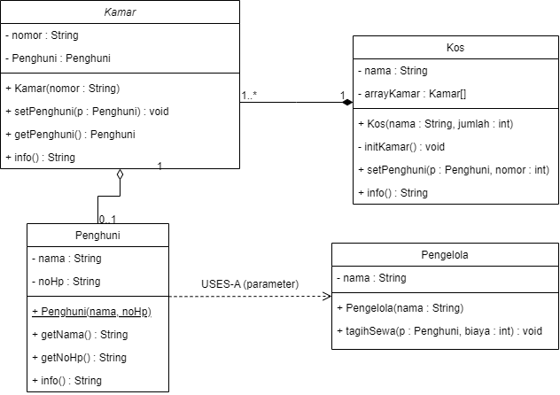

|            | Praktikum Pemrograman Berbasis Objek                                                        |
| ---------- | ------------------------------------------------------------------------------------------- |
| NIM        | 254107020130                                                                                |
| Nama       | Achmad Pradita Dwi Firmansyah                                                               |
| Kelas      | TI - 2G                                                                                     |
| Repository | [link](https://github.com/praditadf/PraktikumPemrogramanBerbasisObjek/tree/main/jobsheet04) |

# Percobaan

## Percobaan 1

### Class Processor.java

```
public class Processor {
    private String merk;
    private double cache;

    public Processor() {
    }

    public Processor(String merk, double cache) {
        this.merk = merk;
        this.cache = cache;
    }

    public void setMerk(String merk) {
        this.merk = merk;
    }

    public String getMerk() {
        return merk;
    }

    public void setCache(double cache) {
        this.cache = cache;
    }

    public double getCache() {
        return cache;
    }

    public void info() {
        System.out.printf("Merk Processor = %s\n", merk);
        System.out.printf("Cache Memory = %.2f\n", cache);
    }
}
```

### Class Laptop.java

```
public class Laptop {
    private String merk;
    private Processor proc;

    public Laptop() {
    }

    public Laptop(String merk, Processor proc) {
        this.merk = merk;
        this.proc = proc;
    }

    public void setMerk(String merk) {
        this.merk = merk;
    }

    public String getMerk() {
        return merk;
    }

    public void setProc(Processor proc) {
        this.proc = proc;
    }

    public Processor getProc() {
        return proc;
    }

    public void info() {
        System.out.println("Merk Laptop = " + merk);
        proc.info();
    }
}
```

### Class MainPercobaan1.java

```
public class MainPercobaan1 {
    public static void main(String[] args) {
        Processor p = new Processor("Intel i5", 3);
        Laptop l = new Laptop("Thinkpad", p);
        l.info();

        Processor p1 = new Processor();
        p1.setMerk("Intel i5");
        p1.setCache(4);
        Laptop l1 = new Laptop();
        l1.setMerk("Thinkpad");
        l1.setProc(p1);
        l1.info();

        Laptop l2 = new Laptop("Thinkpad",
                new Processor("Intel i5", 3));
        l2.info();
    }
}

```

### Hasil Run Terminal

```
PS C:\PENYIMPANAN\Documents\PraktikumPemrogramanBerbasisObjek>
Merk Laptop = Thinkpad
Merk Processor = Intel i5
Cache Memory = 3,00
Merk Laptop = Thinkpad
Merk Processor = Intel i5
Cache Memory = 4,00
Merk Laptop = Thinkpad
Merk Processor = Intel i5
Cache Memory = 3,00
PS C:\PENYIMPANAN\Documents\PraktikumPemrogramanBerbasisObjek>
```

## Pertanyaan Percobaan 1

1. Di dalam class Processor dan class Laptop, terdapat method setter dan getter untuk masingmasing atributnya. Apakah gunanya method setter dan getter tersebut?

```
Method getter Untuk mengakses nilai dari suati atribut yang private sedangkan setter untuk menset nilai dari suatu atribut yang private
```

2. Di dalam class Processor dan class Laptop, masing-masing terdapat konstruktor default dan konstruktor berparameter. Bagaimanakah beda penggunaan dari kedua jenis konstruktor tersebut?

```
- Konstruktor default tidak ada nilai parameter, dan ketika memanggil tidak memerlukan memasukkan nilai parameter.
- Konstruktor berparameter memiliki nilai parameter, dan ketika pemanggilan perlu memasukkan nilai parameternya
```

3. Perhatikan class Laptop, di antara 2 atribut yang dimiliki (merk dan proc), atribut manakah yang ertipe object? Baris kode manakah yang menunjukkan bahwa class Laptop memiliki relasi dengan class Processor?

```
Atribut yang bertipe object adalah Proc dan baris yang menunjukkan relasi Laptop ke Processor adalah
private Processor proc;
```

4. Perhatikan pada class Laptop, apakah guna dari sintaks proc.info()?

```
Untuk memanggil method info dari class Processor lewat class Laptop
```

5. Pada Langkah 8, objek p dibuat lebih dulu baru diberikan ke constructor Laptop. Pada Langkah 10, objek Processor dibuat langsung di dalam argumen constructor Laptop (tanpa variabel p). Apakah keduanya menghasilkan output yang berbeda? Mengapa?

```
Sama, Karena pada Langkah 8 objek Processor dibuat terlebih dahulu dan diberikan melalui variabel p, sedangkan pada Langkah 10 objek Processor dibuat langsung sebagai lalu dimasukkan ke constructor Laptop.
```

6. Secara kode, apakah relasi Laptop-Processor pada percobaan ini termasuk Aggregation atau Composition? Tunjukkan baris kode yang menjadi bukti jawabanmu.

```
Agregation, karena objek Processor dibuat di Main bukan di Laptop
Processor p = new Processor("Intel i5", 3);
```

7. Andaikan constructor Laptop diubah menjadi seperti berikut, sehingga Processor dibuat sendiri di dalam Laptop, bukan diterima sebagai parameter:
   public Laptop (String merk) {
   this.merk = merk;
   this.proc = new Processor ("Generic", 1);
   }
   Apakah relasi Laptop-Processor pada versi ini masih Aggregation? Jelaskan alasannya (jawaban ini akan kita buktikan sendiri lewat kode pada Percobaan 5).

```
Composition, karena Processor sekarang dibuat langsung oleh Laptop
```

## Percobaan 2

### Class Mobil.java

```
public class Mobil {
    private String Merk;
    private int biaya;

    public Mobil() {

    }

    public void setMerk(String Merk) {
        this.Merk = Merk;
    }

    public String getMerk() {
        return Merk;
    }

    public void setBiaya(int biaya) {
        this.biaya = biaya;
    }

    public int getBiaya() {
        return biaya;
    }

    public int hitungBiayaMobil(int hari) {
        return biaya * hari;
    }
}
```

### Class Sopir.java

```
public class Sopir {
    private String nama;
    private int biaya;

    public Sopir() {

    }

    public void setNama(String nama) {
        this.nama = nama;
    }

    public String getNama() {
        return nama;
    }

    public void setBiaya(int biaya) {
        this.biaya = biaya;
    }

    public int getBiaya() {
        return biaya;
    }

    public int hitungBiayaSopir(int hari) {
        return biaya * hari;
    }
}
```

### Class Pelanggan.java

```
public class Pelanggan {

    private String nama;
    private Mobil mobil;
    private Sopir sopir;
    private int hari;

    public Pelanggan() {

    }

    public void setNama(String nama) {
        this.nama = nama;
    }

    public String getNama() {
        return nama;
    }

    public void setMobil(Mobil mobil) {
        this.mobil = mobil;
    }

    public Mobil getMobil() {
        return mobil;
    }

    public void setSopir(Sopir sopir) {
        this.sopir = sopir;
    }

    public Sopir getSopir() {
        return sopir;
    }

    public void setHari(int hari) {
        this.hari = hari;
    }

    public int getHari() {
        return hari;
    }

    public int hitungBiayaTotal() {
        return mobil.hitungBiayaMobil(hari) + sopir.hitungBiayaSopir(hari);
    }
}
```

### Class MainPercobaan2.java

```
public class MainPercobaan2 {
    public static void main(String[] args) {
        Mobil m = new Mobil();
        m.setMerk("Avanza");
        m.setBiaya(350000);

        Sopir s = new Sopir();
        s.setNama("John Doe");
        s.setBiaya(200000);

        Pelanggan p = new Pelanggan();
        p.setNama("John Doe");
        p.setMobil(m);
        p.setSopir(s);
        p.setHari(3);

        System.out.println("Biaya Total - " + p.hitungBiayaTotal());

        System.out.println(p.getMobil().getMerk());
    }
}
```

### Hasil Run Terminal

```
PS C:\PENYIMPANAN\Documents\PraktikumPemrogramanBerbasisObjek>
Biaya Total - 1650000
Avanza
PS C:\PENYIMPANAN\Documents\PraktikumPemrogramanBerbasisObjek>
```

## Pertanyaan Percobaan 2

1. Perhatikan class Pelanggan. Pada baris program manakah yang menunjukkan bahwa class Pelanggan memiliki relasi dengan class Mobil dan class Sopir?

```
    private Mobil mobil;
    private Sopir sopir;
```

2. Perhatikan method hitungBiayaSopir pada class Sopir, serta method hitungBiayaMobil pada class Mobil. Mengapa method tersebut harus memiliki argument hari, padahal hari sendiri adalah atribut milik Pelanggan, bukan milik Mobil atau Sopir?

```
Karena biaya mobil dan sopir bergantung pada berapa lama sewanya, dan class mobil dan sopir hanya tahu biaya per hari sehingga atribut hari adalah atribut yang masuk ke pelanggan, bukan mobil dan sopir
```

3. Perhatikan kode dari class Pelanggan. Untuk apakah perintah mobil.hitungBiayaMobil(hari) dan sopir.hitungBiayaSopir(hari)?

```
Untuk menghitung biaya mobil dan menghitung biaya sopir, dan melalui class mobil dan sopir karena method tersebut ada di class mobil dan sopir
```

4. Perhatikan class MainPercobaan2. Untuk apakah sintaks p.setMobil(m) dan p.setSopir(s)?

```
Untuk menset mobil dan sopir yang digunakan oleh pelanggan p
```

5. Untuk apakah proses p.hitungBiayaTotal()?

```
Untuk menghitung total biaya sewa
350000 * 3 + 200000 * 3
1050000    + 600000
1650000
```

6. Pada Langkah 7, p.getMobil().getMerk() memanggil dua method sekaligus secara berantai. Jelaskan urutan eksekusinya: objek apa yang dikembalikan p.getMobil(), dan objek apa yang kemudian dipanggil .getMerk()-nya?

```
p.getMobil() mengembalikan objek mobil, .getMerk() dan mengambil merek dari mobil
```

7. Andaikan p.setMobil(m) tidak pernah dipanggil lalu p.hitungBiayaTotal() dijalankan, error apa yang akan muncul? Jelaskan mengapa error itu terjadi, dikaitkan dengan konsep referensi objek yang sudah kita pelajari sebelumnya

```
NullPointerException, karena object mobil masih kosong / tidak pernah dipanggil
```

## Percobaan 3

### Class Pegawai.java

```
public class Pegawai {
    private String nip;
    private String nama;

    public Pegawai(String nip, String nama) {
        this.nip = nip;
        this.nama = nama;
    }

    public void setNip(String nip) {
        this.nip = nip;
    }

    public String getNip() {
        return nip;
    }

    public void setNama(String nama) {
        this.nama = nama;
    }

    public String getNama() {
        return nama;
    }

    public String info() {
        String info = "";
        info += "Nip: " +this.nip+"\n";
        info += "Nama: " +this.nama+"\n";
        return info;
    }
}
```

### Class KeretaApi.java

```
public class KeretaApi {
    private String nama;
    private String kelas;
    private Pegawai masinis;
    private Pegawai asisten;

    public KeretaApi(String nama, String kelas, Pegawai masinis) {
        this.nama = nama;
        this.kelas = kelas;
        this.masinis = masinis;
    }

    public KeretaApi(String nama, String kelas, Pegawai masinis, Pegawai asisten) {
        this.nama = nama;
        this.kelas = kelas;
        this.masinis = masinis;
        this.asisten = asisten;
    }

    public void setMasinis(Pegawai masinis) {
        this.masinis = masinis;
    }

    public Pegawai getMasinis() {
        return masinis;
    }

    public void setAsisten(Pegawai asisten) {
        this.asisten = asisten;
    }

    public Pegawai getAsisten() {
        return asisten;
    }

    public String info() {
        String info = "";
        info += "Nama: " +this.nama + "\n";
        info += "kelas: " +this.kelas + "\n";
        info += "Masinis: " +this.masinis.info() + "\n";
        if (this.asisten != null) {
            info += "Asisten: " +this.asisten.info() + "\n";
        }
        return info;
    }
}
```

### Class MainPercobaan3.java

```
public class MainPercobaan3 {
    public static void main(String[] args) {
        Pegawai masinis = new Pegawai("1234", "Spongebob Squarepants");
        Pegawai asisten = new Pegawai("4567", "Patrick Star");
        KeretaApi keretaApi = new KeretaApi("GayaBaru", "Bisnis", masinis, asisten);
        System.out.println(keretaApi.info());
    }
}
```

### Class MainPertanyaan.java

```
public class MainPertanyaan {
    public static void main(String[] args) {
        Pegawai masinis = new Pegawai("1234", "Spongebob Squarepants");
        KeretaApi keretaApi = new KeretaApi("GayaBaru", "Bisnis", masinis);
        System.out.println(keretaApi.info());
    }
}
```

### Hasil Run Terminal MainPertanyaan.java

```
PS C:\PENYIMPANAN\Documents\PraktikumPemrogramanBerbasisObjek>
Nama: GayaBaru
kelas: Bisnis
Masinis: Nip: 1234
Nama: Spongebob Squarepants


PS C:\PENYIMPANAN\Documents\PraktikumPemrogramanBerbasisObjek>
```

### Hasil Run Terminal MainPercobaan3.java

```
PS C:\G\PraktikumPemrogramanBerbasisObjek>
Nama: GayaBaru
kelas: Bisnis
Masinis: Nip: 1234
Nama: Spongebob Squarepants

Asisten: Nip: 4567
Nama: Patrick Star


PS C:\G\PraktikumPemrogramanBerbasisObjek>
```

## Pertanyaan Percobaan 3

1. Di dalam method info() pada class KeretaApi, baris this.masinis.info() dan this.asisten.info() digunakan untuk apa?

```
Baris tersebut digunakan untuk memanggil method info yang dimiliki oleh class pegawai untuk menampilkan NIP dan nama pegawai
```

2. Apa hasil output dari MainPertanyaan sebelum diperbaiki (Langkah 8)? Mengapa hal tersebut dapat terjadi?

```
Sebelum diperbaiki output MainPertanyaan adalah NullPointerException, karena belum di isi data asisten namun sudah dipanggil sehingga menyebabkan eror NullPointerException
```

3. Kaitkan dengan materi referensi objek: apa isi variabel asisten di dalam objek KeretaApi yang dibuat lewat constructor 3-parameter, sebelum guard clause ditambahkan?

```
Isi variabel asisten di dalam objek KeretaApi adalah null
```

4. Setelah guard clause ditambahkan (Langkah 9), apakah objek masinis juga perlu dicek dengan cara yang sama? Perhatikan kedua constructor KeretaApi, apakah mungkin masinis bernilai null? Jelaskan.

```
Objek masinis tidak perlu di cek karena ketika pembuatan objek KeretaApi diharuskan mengisi parameter masinis karena terdapat salah satu konstruktor yang memiliki parameter masinis
```

5. Kelas Pegawai dipakai lewat dua atribut berbeda (masinis dan asisten) pada KeretaApi. Apakah ini membuat KeretaApi punya dua objek Pegawai yang berbeda, atau satu objek Pegawai yang dipakai dua kali? Jelaskan berdasarkan kode pada Langkah 6

```
Dua objek Pegawai yang berbeda karena disimpan pada variabel yang berbeda yaitu masinis dan asisten
```

## Percobaan 4

### Class Penumpang.java

```
public class Penumpang {
    private String ktp;
    private String nama;

    public Penumpang(String ktp, String nama) {
        this.ktp = ktp;
        this.nama = nama;
    }

    public String getKtp() {
        return ktp;
    }

    public String getNama() {
        return nama;
    }

    public String info() {
        String info = "";
        info += "Ktp: " + ktp + "\n";
        info += "Nama: " + nama + "\n";
        return info;
    }
}
```

### Class Kursi.java

```
public class Kursi {
    private String nomor;
    private Penumpang penumpang;

    public Kursi(String nomor) {
        this.nomor = nomor;
    }

    public void setPenumpang(Penumpang penumpang) {
        this.penumpang = penumpang;
    }

    public Penumpang getPenumpang() {
        return penumpang;
    }

    public String info() {
        String info = "";
        info += "Nomor= " + nomor + "\n";
        if (this.penumpang != null) {
            info += "Penumpang: " + penumpang.info() + "\n";
        }
        return info;
    }
}
```

### Class Gerbong.java

```
public class Gerbong {
    private String kode;
    private Kursi[] arrayKursi;

    public Gerbong(String kode, int jumlah) {
        this.kode = kode;
        this.arrayKursi = new Kursi[jumlah];
        this.initKursi();
    }

    private void initKursi() {
        for (int i = 0; i < arrayKursi.length; i++) {
            this.arrayKursi[i] = new Kursi(String.valueOf(i + 1));
        }
    }

    public void setPenumpang(Penumpang penumpang, int nomor) {
        this.arrayKursi[nomor - 1].setPenumpang(penumpang);
    }

    public String info() {
        String info = "";
        info += "Kode: " + kode + "\n";
        for (Kursi kursi : arrayKursi) {
            info += kursi.info();
        }
        return info;
    }
}
```

### Class MainPercobaan4.java

```
public class MainPercobaan4 {
    public static void main(String[] args) {
        Penumpang p = new Penumpang("12345", "Mr. Krab");
        Gerbong gerbong = new Gerbong("A", 10);
        gerbong.setPenumpang(p, 1);
        System.out.println(gerbong.info());
    }
}
```

### Hasil Run Terminal

```
PS C:\PENYIMPANAN\Documents\PraktikumPemrogramanBerbasisObjek>
Kode: A
Nomor= 1
Penumpang: Ktp: 12345
Nama: Mr. Krab

Nomor= 2
Nomor= 3
Nomor= 4
Nomor= 5
Nomor= 6
Nomor= 7
Nomor= 8
Nomor= 9
Nomor= 10

PS C:\PENYIMPANAN\Documents\PraktikumPemrogramanBerbasisObjek>
```

## Pertanyaan Percobaan 4

1. Pada main program dalam class MainPercobaan4, berapakah jumlah kursi dalam Gerbong A?

```
10
```

2. Perhatikan potongan kode if (this.penumpang != null) { ... } pada method info() dalam class Kursi. Apa maksud kode tersebut?

```
Kode if tersebut untuk mengecek apakan penumpang tidak kosong, jika tidak kosong maka info penumpang akan ditampilkan
```

3. Mengapa pada method setPenumpang() dalam class Gerbong, nilai nomor dikurangi dengan angka 1?

```
Karena urutan indeks dimulai dari 0 dan nomor kursi dimulai dari 1, sehingga kita perlu mengurangi 1 nomor
```

4. Instansiasi objek baru budi dengan tipe Penumpang, kemudian masukkan objek baru tersebut pada gerbong dengan gerbong.setPenumpang(budi, 1), menimpa Mr. Krab yang sudah duduk di sana. Apakah yang terjadi? Apakah Java memberi peringatan/error?

```
public class MainPercobaan4 {
    public static void main(String[] args) {
        Penumpang p = new Penumpang("12345", "Mr. Krab");
        Gerbong gerbong = new Gerbong("A", 10);
        gerbong.setPenumpang(p, 1);
        System.out.println(gerbong.info());

        Penumpang budi = new Penumpang("67890", "Budi");
        gerbong.setPenumpang(budi, 1);
        System.out.println(gerbong.info());
    }
}

PS C:\PENYIMPANAN\Documents\PraktikumPemrogramanBerbasisObjek>
Kode: A
Nomor= 1
Penumpang: Ktp: 12345
Nama: Mr. Krab

Nomor= 2
Nomor= 3
Nomor= 4
Nomor= 5
Nomor= 6
Nomor= 7
Nomor= 8
Nomor= 9
Nomor= 10

Kode: A
Nomor= 1
Penumpang: Ktp: 67890
Nama: Budi

Nomor= 2
Nomor= 3
Nomor= 4
Nomor= 5
Nomor= 6
Nomor= 7
Nomor= 8
Nomor= 9
Nomor= 10

PS C:\PENYIMPANAN\Documents\PraktikumPemrogramanBerbasisObjek>
```

```
Object baru tersebut menimpa penumpang lama dan java tidak memberikan peringatan/error
```

5. Modifikasi program sehingga tidak diperkenankan menduduki kursi yang sudah ada penumpang lain (tambahkan pengecekan pada Gerbong.setPenumpang() sebelum baris arrayKursi[nomor - 1].setPenumpang(...) dijalankan).

```
MainPercobaan4.java
public class MainPercobaan4 {
    public static void main(String[] args) {
        Penumpang p = new Penumpang("12345", "Mr. Krab");
        Gerbong gerbong = new Gerbong("A", 10);
        gerbong.setPenumpang(p, 1);
        System.out.println(gerbong.info());

        Penumpang budi = new Penumpang("67890", "Budi");
        gerbong.setPenumpang(budi, 1);
        System.out.println(gerbong.info());
    }
}

Gerbong.java
    public void setPenumpang(Penumpang penumpang, int nomor) {
        if (nomor < 1 || nomor > arrayKursi.length) {
            System.out.println("Kursi tidak tersedia.");
        }else if (arrayKursi[nomor - 1].getPenumpang() != null) {
            System.out.println("Kursi sudah ada penumpang lain.\n");
        } else {
            arrayKursi[nomor - 1].setPenumpang(penumpang);
        }
    }

Hasil Run Terminal
PS C:\PENYIMPANAN\Documents\PraktikumPemrogramanBerbasisObjek>
Kode: A
Nomor= 1
Penumpang: Ktp: 12345
Nama: Mr. Krab

Nomor= 2
Nomor= 3
Nomor= 4
Nomor= 5
Nomor= 6
Nomor= 7
Nomor= 8
Nomor= 9
Nomor= 10

Kursi sudah ada penumpang lain.

Kode: A
Nomor= 1
Penumpang: Ktp: 12345
Nama: Mr. Krab

Nomor= 2
Nomor= 3
Nomor= 4
Nomor= 5
Nomor= 6
Nomor= 7
Nomor= 8
Nomor= 9
Nomor= 10

PS C:\PENYIMPANAN\Documents\PraktikumPemrogramanBerbasisObjek>
```

6. Bandingkan tiga bentuk relasi has-a yang sudah kita praktikkan: Laptop-Processor (Percobaan 1, 1-1), KeretaApi-Pegawai (Percobaan 3, dua relasi 1-1 bernama), dan Gerbong-Kursi (Percobaan 4, 1..\*). Untuk kasus seperti apa kita akan memilih array, dan untuk kasus seperti apa kita akan memilih atribut bernama satu-satu?

```
Array dipilih ketika banyak objek yang perannya sama, sedangkan atribut bernama satu-satu dipilih ketika tiap objek punya peran yang berbeda(masinis dan asisten)
```

7. Terapkan kriteria kode (siapa yang memanggil new) pada dua relasi has-a di Percobaan ini: GerbongKursi dan Kursi-Penumpang. Manakah yang Aggregation dan manakah yang Composition? Tunjukkan baris kode yang menjadi bukti untuk masing-masing.

```
Aggregation: Kursi-Penumpang, karena objek Penumpang dibuat dari luar class Kursi dan kemudian diberikan melalui setter
Composition: GerbongKursi, karena di dalam class Gerbong terdapat pembuatan array kursi sendiri
```

## Percobaan 5

### Class Mesin.java

```
public class Mesin {
    private String tipe;

    public Mesin() {
        this.tipe = "4-silinder";
    }

    public String getTipe() {
        return tipe;
    }
}
```

### Class Mobil.java

```
public class Mobil {
    private String merek;
    private Mesin mesin;

    public Mobil(String merek) {
        this.merek = merek;
        this.mesin = new Mesin();
    }

    public void tampilkanInfo() {
        System.out.println("Mobil: " + merek);
        System.out.println("Mesin: " + mesin.getTipe());
    }
}
```

### Class MainPercobaan5.java

```
public class MainPercobaan5 {
    public static void main(String[] args) {
        Mobil mobil = new Mobil("Avanza");
        mobil.tampilkanInfo();
    }
}
```

### Hasil Run Terminal

```
PS C:\PENYIMPANAN\Documents\PraktikumPemrogramanBerbasisObjek>
Mobil: Avanza
Mesin: 4-silinder
PS C:\PENYIMPANAN\Documents\PraktikumPemrogramanBerbasisObjek>
```

## Pertanyaan Percobaan 5

1. Pada class Mobil, baris manakah yang menunjukkan bahwa Mesin adalah bagian yang “dimiliki secara eksklusif” oleh Mobil (bukan sekadar “dipinjam”)?

```
this.mesin = new Mesin(); Ketika mobil dibuat maka mesin akan dibuat juga oleh object mobil tersebut
```

2. Apa yang terjadi secara desain jika ditambahkan method setMesin(Mesin mesin) pada class Mobil? Apakah relasi ini akan tetap menjadi Composition? Jelaskan.

```
Jika hanya ditambahkan method setMesin(Mesin mesin), relasi akan tetap menjadi compotition, selama mobil membuat mesin melalui konstruktor.
```

3. Bandingkan dengan Percobaan 1 (Laptop-Processor): sebutkan satu perbedaan baris kode yang membuat salah satunya Aggregation dan yang lain Composition.

```

```

4. Jika objek mobil di MainPercobaan5 di-set null setelah tampilkanInfo() dipanggil, apa yang terjadi pada objek Mesin miliknya? Bandingkan dengan nasib objek Processor pada Percobaan 1 seandainya objek Laptop-nya dihapus, apakah Processor tersebut masih bisa “diselamatkan” oleh kode lain? Kenapa Mesin tidak bisa?

```
Ketika objek mobil di-set null maka objek mesin tersebut tidak akan bisa diakses oleh program, namun jika Laptop-nya dihapus objek Processor masih bisa diakses melalui variabel p, karena objek mesin dibuat oleh mobil dan di MainPercobaan5 tidak ada variabel lain untuk menyimpan mesin
```

5. Coba (secara terpisah, boleh di file/package percobaan sendiri) tambahkan constructor kedua pada Mobil yang menerima parameter Mesin, mirip pola Percobaan 1: public Mobil(String merek, Mesin mesin) { this.merek = merek; this.mesin = mesin; }. Kalau constructor ini yang dipakai, apakah Mobil-Mesin berubah menjadi Aggregation? Jelaskan alasannya.

```
Ketika ditambah constructor kedua pada mobil
    public Mobil(String merek, Mesin mesin) {
        this.merek = merek;
        this.mesin = mesin;
    }
Ketika constructor itu dipakai, Mobil-mesin berubah menjadi agregation, karena objek mesin dibuat diluar class mesin dan kemudian di masukkan kedalam mobil.
```

## Percobaan 6

### Class Printer.java

```
package jobsheet04.percobaan6;

public class Printer {
    private String merk;

    public Printer(String merk) {
        this.merk = merk;
    }

    public void cetak(String namaFile) {
        System.out.println("[" + merk + "] Mencetak " + namaFile + "...");
        System.out.println("[" + merk + "] Selesai.");
    }
}
```

### Class Laptop.java

```
package jobsheet04.percobaan6;

public class Laptop {
    private String merk;

    public Laptop(String merk) {
        this.merk = merk;
    }

    public void cetakDokumen(Printer printer, String namaFile) {
        System.out.println(merk + " mengirim dokumen ke printer...");
        printer.cetak(namaFile);
    }
}
```

### Class MainPercobaan6.java

```
package jobsheet04.percobaan6;

public class MainPercobaan6 {
    public static void main(String[] args) {
        Laptop laptop = new Laptop("Thinkpad");
        Printer printer = new Printer("Epson L3110");
        laptop.cetakDokumen(printer, "Laporan.pdf");
    }
}
```

### Hasil Run Terminal

```
PS C:\G\PraktikumPemrogramanBerbasisObjek>  & 'C:\Program Files\Java\jdk-24\bin\java.exe' '-XX:+ShowCodeDetailsInExceptionMessages' '-cp' 'C:\Users\ACER\AppData\Roaming\Code\User\workspaceStorage\8c58ab1930ab3c626e9b4193441e71b6\redhat.java\jdt_ws\PraktikumPemrogramanBerbasisObjek_c5fe0237\bin' 'jobsheet04.percobaan6.MainPercobaan6'
Thinkpad mengirim dokumen ke printer...
[Epson L3110] Mencetak Laporan.pdf...
[Epson L3110] Selesai.
PS C:\G\PraktikumPemrogramanBerbasisObjek>
```

## Pertanyaan Percobaan 6

1. Apakah class Laptop pada percobaan ini memiliki atribut bertipe Printer? Bandingkan dengan Percobaan 1, di mana Processor disimpan sebagai atribut Laptop.

```
Class laptop hanya mempunyai parameter bertipe Printer, berbeda dengan percobaan 1 dimana class Laptop memiliki atribut Processor .
```

2. Setelah method cetakDokumen() selesai dijalankan, apakah Laptop masih menyimpan referensi ke objek printer yang tadi dipakai? Jelaskan berdasarkan baris kode class Laptop.

```
Setelah menggunakan method cetakDokumen(), Laptop tidak menyimpan referensi ke objek printer, karena objek printer hanya digunakan dalam method cetakDokumen() bukan sebagai atribut sehingga Laptop tidak akan menyimpan referensi objek ketika selesai menggunakan method cetakDokumen().
```

3. Mengapa relasi Laptop-Printer pada percobaan ini disebut Dependency (uses-a), bukan Aggregation, meskipun sama-sama melibatkan dua objek yang saling berinteraksi?

```
Karena Laptop tidak menyimpan Printer sebagai atribut melainkan hanya sebagai parameter method.
```

4. Coba ubah kode Laptop supaya Printer disimpan sebagai atribut (mis. private Printer printerDefault, diisi lewat constructor atau setter, lalu dipakai kembali di cetakDokumen() tanpa parameter Printer). Apakah relasi ini sekarang berubah dari Dependency menjadi Aggregation? Jelaskan.

```
package jobsheet04.percobaan6;

public class Laptop {
    private String merk;
    private Printer printerDefault;

    public Laptop(String merk, Printer printerDefault) {
        this.merk = merk;
        this.printerDefault = printerDefault;
    }

    public void cetakDokumen(String namaFile) {
        System.out.println(merk + " mengirim dokumen ke printer...");
        printerDefault.cetak(namaFile);
    }
}
package jobsheet04.percobaan6;

public class MainPercobaan6 {
    public static void main(String[] args) {
        Printer printer = new Printer("Epson L3110");
        Laptop laptop = new Laptop("Thinkpad", printer);
        laptop.cetakDokumen("Laporan.pdf");
    }
}
Ketika Printer diubah menjadi atribut, maka relasi tersebut berubah menjadi Aggregation, karena Laptop sekarang menyimpan referensi objek printer walaupun setelah menggunakan method cetakDokumen()
```

5. Lengkapi tabel berikut dengan kata-katamu sendiri (boleh dijawab di laporan): untuk masing-masing dari Aggregation, Composition, dan Dependency, sebutkan (a) apakah objek part disimpan sebagai atribut atau tidak, dan (b) siapa yang memanggil new untuk membuat objek part tersebut.

```
Aggregation     Part disimpan sebagai atribut           Objek part dibuat dari luar
Composition     Part disimpan sebagai atribut           Objek itu sendiri yang membuat part
Dependency      Part tidak disimpan sebagai atribut     Objek hanya di berikan dari luar dan digunakan sementara
```

## Tugas mandiri:

1. Rancang satu studi kasus sendiri (bebas topiknya, misalnya perpustakaan, klinik, toko online, dsb.), gambarkan diagram kelasnya, lalu implementasikan ke dalam program. Studi kasus wajib melibatkan minimal 4 class (class yang berisi main tidak dihitung) dan wajib mencakup ketiganya: minimal satu relasi Aggregation, satu Composition, dan satu Dependency. Tandai pada laporanmu, bagian mana dari kode yang merupakan masing-masing jenis relasi tersebut, dan sertakan alasannya.

   

### Class Kos

```
package jobsheet04.Tugas;

public class Kos {
    private String nama;
    private Kamar [] arrayKamar;

    public Kos(String nama, int jumlah) {
        this.nama = nama;
        this.arrayKamar = new Kamar[jumlah];
        this.initKamar();
    }

    private void initKamar() {
        for (int i = 0; i < arrayKamar.length; i++) {
            arrayKamar[i] = new Kamar(String.valueOf(i + 1));
        }
    }

    public void setPenghuni(Penghuni penghuni, int nomor) {
        if (nomor < 1 || nomor > arrayKamar.length) {
            System.out.println("Kamar tidak tersedia.");
        } else if (arrayKamar[nomor - 1].getPenghuni() != null) {
            System.out.println("Kamar sudah ada penghuni lain.\n");
        } else {
            arrayKamar[nomor - 1].setPenghuni(penghuni);
        }
    }

    public String info() {
        String info = "";
        info += "Kos: " + nama + "\n";
        for (Kamar kamar : arrayKamar) {
            info += kamar.info();
        }
        return info;
    }
}

```

### Class Kamar

```
package jobsheet04.Tugas;

public class Kamar {
    private String nomor;
    private Penghuni penghuni;

    public Kamar(String nomor) {
        this.nomor = nomor;
    }

    public void setPenghuni(Penghuni penghuni) {
        this.penghuni = penghuni;
    }

    public Penghuni getPenghuni() {
        return penghuni;
    }

    public String info() {
        String info = "";
        info += "Kamar " + nomor + " :\n";
        if (this.penghuni != null) {
            info += penghuni.info();
        }
        return info;
    }
}

```

### Class Penghuni

```
package jobsheet04.Tugas;

public class Penghuni {
    private String nama;
    private String noHp;

    public Penghuni(String nama, String noHp) {
        this.nama = nama;
        this.noHp = noHp;
    }

    public String getNama() {
        return nama;
    }

    public String getNoHp() {
        return noHp;
    }

    public String info() {
        String info = "";
        info += "Nama: " + nama + "\n";
        info += "No HP: " + noHp + "\n";
        return info;
    }
}

```

### Class Pengelola

```
package jobsheet04.Tugas;

public class Pengelola {
    private String nama;

    public Pengelola(String nama) {
        this.nama = nama;
    }

    public void tagihSewa(Penghuni penghuni, int biaya) {
        System.out.println("Pengelola " + nama + " menagih kepada " + penghuni.getNama() + " sebesar Rp" + biaya + ".\n");
    }
}

```

### Class MainKos

```
package jobsheet04.Tugas;

public class MainKos {
    public static void main(String[] args) {
        Kos kos = new Kos("Kos A", 10);

        Penghuni p1 = new Penghuni("Budi", "081234567890");
        Penghuni p2 = new Penghuni("Alex", "089876543210");

        kos.setPenghuni(p1, 1);
        kos.setPenghuni(p2, 2);

        System.out.println(kos.info());

        Pengelola pengelola = new Pengelola("Achmad");

        pengelola.tagihSewa(p1, 450000);
        pengelola.tagihSewa(p2, 450000);
    }
}

```

### Hasil Run Terminal

```
PS C:\G\PraktikumPemrogramanBerbasisObjek>
Kos: Kos A
Kamar 1 :
Nama: Budi
No HP: 081234567890
Kamar 2 :
Nama: Alex
No HP: 089876543210
Kamar 3 :
Kamar 4 :
Kamar 5 :
Kamar 6 :
Kamar 7 :
Kamar 8 :
Kamar 9 :
Kamar 10 :

Pengelola Achmad menagih kepada Budi sebesar Rp450000.

Pengelola Achmad menagih kepada Alex sebesar Rp450000.

PS C:\G\PraktikumPemrogramanBerbasisObjek>
```

## Relasi Aggregation, Composition, dan Dependency

### Aggregation
```
Objek Penghuni dibuat di Main, lalu dimasukkan ke Kamar lewat method
public void setPenghuni(Penghuni penghuni)
```
### Composition
```
Objek Kamar di-new langsung di dalam class Kos
this.arrayKamar = new Kamar[jumlah];
```
### Dependency
```
Objek Penghuni hanya muncul sebagai parameter di dalam method
public void tagihSewa(Penghuni penghuni, int biaya)
```

2. Jawab singkat (3-5 kalimat): dalam merancang sistem barumu sendiri, bagaimana kita memutuskan sebuah relasi antar class seharusnya Aggregation, Composition, atau Dependency? Sebutkan pertanyaan kunci yang kita ajukan ke diri sendiri saat memutuskan.
```
Untuk memutuskan sebuah relasi class, terdapat pertanyaan apakah objek A di simpan sebagai atribut di B, dan jika ya, siapa yang memanggil new untuk membuat objek part tersebut? Kalau A tidak disimpan sebagai atribut di B, melainkan hanya sebagai parameter method maka relasinya Dependency. Kalau A disimpan sebagai atribut tetapi pembuatan objeknya di luar B lalu diserahkan lewat constructor atau setter, maka relasinya Aggregation. Kalau A disimpan sebagai atribut dan B yang memanggil new untuk membuatnya di dalam constructor, maka relasinya Composition.
```