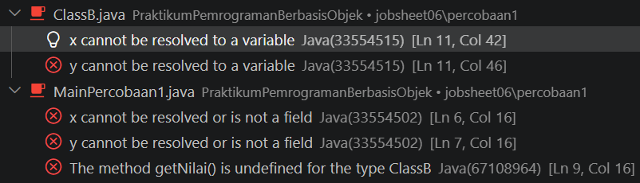

|            | Praktikum Pemrograman Berbasis Objek                                                        |
| ---------- | ------------------------------------------------------------------------------------------- |
| NIM        | 254107020130                                                                                |
| Nama       | Achmad Pradita Dwi Firmansyah                                                               |
| Kelas      | TI - 2G                                                                                     |
| Repository | [link](https://github.com/praditadf/PraktikumPemrogramanBerbasisObjek/tree/main/jobsheet06) |

# Percobaan

## Percobaan 1

### Class ClassA.java

```
package jobsheet06.percobaan1;

public class ClassA {
    public int x;
    public int y;

    public void getNilai() {
        System.out.println("nilai x: " + x);
        System.out.println("nilai y: " + y);
    }
}
```

### Class ClassB.java

```
package jobsheet06.percobaan1;

public class ClassB extends ClassA{
    public int z;

    public void getNilaiz() {
        System.out.println("nilai z: " + z);
    }

    public void getJumlah() {
        System.out.println("jumlah: " + (x + y + z));
    }
}
```

### Class MainPercobaan1.java

```
package jobsheet06.percobaan1;

public class MainPercobaan1 {
    public static void main(String[] args) {
        ClassB hitung = new ClassB();
        hitung.x = 20;
        hitung.y = 30;
        hitung.z = 5;
        hitung.getNilai();
        hitung.getNilaiz();
        hitung.getJumlah();
    }
}

```

### Hasil Run Terminal

```
PS C:\G\PraktikumPemrogramanBerbasisObjek>
nilai x: 20
nilai y: 30
nilai z: 5
jumlah: 55
PS C:\G\PraktikumPemrogramanBerbasisObjek>
```

## Pertanyaan Percobaan 1

1. Mengapa kompilasi pada Langkah 5 gagal? Tuliskan pesan error pertama beserta file dan baris tempat error muncul.

 Karena ClassB tidak punya atribut x dan y


2. Baris kode mana yang diubah pada Langkah 6, dan apa artinya? Sebutkan class yang berperan sebagai superclass dan subclass.

```
public class ClassB extends ClassA
Pewarisan ClassA ke ClassB dengan penambahan "extends ClassA". Dan Class yang berperan sebagai superclass adalah ClassA dan subclass adalah ClassB
```

3. Setelah diperbaiki, sebutkan atribut dan method yang dapat dipakai oleh objek hitung. Kelompokkan mana yang dideklarasikan di ClassA dan mana yang dideklarasikan di ClassB.

```
ClassA  : atribut x, y, dan method getNilai
ClassB  : atribut z, method getNilaiZ dan getJumlah
```

4. Pada MainPercobaan1, hitung.x = 20 ditulis pada objek ClassB, padahal atribut x tidak dideklarasikan di ClassB. Mengapa hal ini diperbolehkan?

```
Karena ClassB mewarisi ClassA sehingga atribut x juga bisa diakses dengan ClassB
```

5. Atribut x dan y pada ClassA dibuat public, sehingga dapat diubah langsung dari MainPercobaan1. Apa risiko dari desain seperti ini? (jawaban ini akan kita telusuri pada Percobaan 2)

```
Risiko nya adalah data x dan y dapat diubah secara bebas oleh class lain
```

6. Coba tambahkan class ClassD lalu ubah deklarasi menjadi public class ClassB extends ClassA, ClassD. Apa yang terjadi? Apa yang dapat Anda simpulkan tentang jumlah superclass langsung pada Java?

```
Ketika ditambahkan ClassD dan deklarasi diubah menjadi public class ClassB extends ClassA, ClassD, maka error "Syntax error on token "}", delete this token" karena suatu subclass hanya dapat memiliki satu parent class
```

## Percobaan 2

### Class ClassA.java

```
package jobsheet06.percobaan2;

public class ClassA {
    private int x;
    private int y;

    public void setX(int x) {
        this.x = x;
    }

    public void setY(int y) {
        this.y = y;
    }

    public void getNilai() {
        System.out.println("nilai x: " + x);
        System.out.println("nilai y: " + y);
    }

    public int getX() {
        return x;
    }

    public int getY() {
        return y;
    }
}
```

### Class ClassB.java

```
package jobsheet06.percobaan2;

public class ClassB extends ClassA {
    private int z;

    public void setZ(int z) {
        this.z = z;
    }

    public void getNilaiZ() {
        System.out.println("nilai z: " + z);
    }

    public void getJumlah() {
        System.out.println("Jumlah: " + (getX() + getY() + z));
    }
}

```

### Class MainPercobaan2.java

```
PS C:\G\PraktikumPemrogramanBerbasisObjek>
nilai x: 20
nilai y: 30
nilai z: 5
Jumlah: 55
PS C:\G\PraktikumPemrogramanBerbasisObjek>
```

## Pertanyaan Percobaan 2

1. Di file dan baris mana error pada Langkah 5 muncul, dan apa pesannya? Mengapa error tidak muncul di MainPercobaan2?
   
   ```
   Error muncul di bagian method getJumlah(). Error tidak muncul di MainPercobaan2 karena MainPercobaan2 mengakses nilai tersebut melalui method setX(), setY(), getX(), dan getY() yang memiliki hak akses public.
   ```
2. Jelaskan penyebab error tersebut dengan merujuk pada tabel kontrol pengaksesan (Langkah 1).

```
Error disebabkan karena atribut x dan y dideklarasikan private sehingga tidak bisa diakses oleh Subclass, seperti merujuk pada tabel kontrol pengaksesan private hanya bisa diakses di class itu sendiri, sehingga hanya ClassA yang bisa mengakses, ClassB tidak bisa mengaksesnya secara langsung.
```

3. Pada kode awal, MainPercobaan2 memanggil hitung.setX(20) dan tidak error, padahal x bersifat private. Mengapa pemanggilan ini diperbolehkan, dan di mana nilai x tersimpan?

```
Karena object hitung memasukkan nilai dengan memanggil method setX yang memiliki hak akses public, walaupun atribut x bersifat private, nilai itu kemudian disimpan pada atribut private x yang dimiliki oleh object tersebut
```

4. Bandingkan Perbaikan A (protected) dan Perbaikan B (private + getter) dari sisi encapsulation. Mana yang Anda pilih untuk program sungguhan? Jelaskan alasannya.

```
Untuk program sungguhan, perbaikan b (private + getter) lebih baik karena data lebih aman tidak bisa diakses langsung dari luar, dan akses nya hanya bisa melalui hak akses selain private untuk mengaksesnya dari luar
```

5. Andaikan ClassA dan ClassB berada di package yang berbeda. Berdasarkan tabel, apakah ClassB tetap dapat mengakses atribut protected milik ClassA? Bagaimana jika atributnya default (tanpa modifier)?

```
Jika ClassA dan ClassB berada di package yang berbeda, ClassB tetap dapat mengakses atribut protected milikA, karena ClassB adalah subclass dari ClassA, namun jika atributnya default dan di package yang berbeda, ClassB tidak akan bisa mengakses atribut default milik ClassA, karena hanya bisa diakses melalui package yang sama.
```

## Percobaan 3

### Class Bangun.java

```
package jobsheet06.percobaan3;

public class Bangun {
    protected double phi;
    protected int r;
}
```

### Class Tabung.java

```
package jobsheet06.percobaan3;

public class Tabung extends Bangun {
    protected int t;
    protected int r = 5;

    public void setSuperPhi(double phi) {
        this.phi = phi;
    }

    public void setSuperR(int r) {
        super.r = r;
    }

    public void setT(int t) {
        this.t = t;
    }

    public void volume() {
        System.out.println("Volume Tabung adalah: "
            + (this.phi * super.r * super.r * this.t));
    }

    public void cekR() {
        System.out.println("r        =" + r);
        System.out.println("this.r   =" + this.r);
        System.out.println("super.r  =" + super.r);
    }
}
```

### Class MainPercobaan3.kava

```
package jobsheet06.percobaan3;

public class Tabung extends Bangun {
    protected int t;
    protected int r = 5;

    public void setSuperPhi(double phi) {
        this.phi = phi;
    }

    public void setSuperR(int r) {
        super.r = r;
    }

    public void setT(int t) {
        this.t = t;
    }

    public void volume() {
        System.out.println("Volume Tabung adalah: "
            + (this.phi * super.r * super.r * this.t));
    }

    public void cekR() {
        System.out.println("r        =" + r);
        System.out.println("this.r   =" + this.r);
        System.out.println("super.r  =" + super.r);
    }
}

```

### Hasil Run Terminal

```
PS C:\G\PraktikumPemrogramanBerbasisObjek>
Volume Tabung adalah: 942.0
r =5
this.r =5
super.r =10
PS C:\G\PraktikumPemrogramanBerbasisObjek>
```

## Pertanyaan Percobaan 3

1. Jelaskan fungsi super pada super.phi = phi; dan super.r = r; di method setSuperPhi() dan setSuperR() milik Tabung.

```
super.phi = phi mengakses phi dai superclass 
super.r = r untuk mengakses r dari variabel superclass
```

2. Jelaskan fungsi super dan this pada ekspresi super.phi _ super.r _ super.r \* this.t di method volume().

```
super.phi merujuk pada atribut phi milik superclass Bangun, sedangkan super.r merujuk pada atribut r milik Bangun. Sementara itu, this.t merujuk pada atribut t milik objek Tabung
```

3. Mengapa Tabung tidak mendeklarasikan atribut phi dan r, tetapi tetap dapat mengaksesnya? Apa yang terjadi bila pada Bangun keduanya diubah menjadi private?

```
Karena Tabung adalah subclass dari Bangun yang memiliki artribut phi dan r dengan hak akses protectted, sehingga class Tabung tetap dapat mengaksesnya walaupun tidak mendeklarasikan atribut tersebut. Namun jika diubah menjadi private maka class Tabung tidak lagi dapat mengakses atribut tersebut
```

4. Pada Eksperimen 1, apakah output berubah ketika super.phi diganti this.phi? Jelaskan mengapa.

```
Output tidak berubah ketika super.phi diganti menjadi this.phi, karena Tabung tidak mendeklarasikan atribut phi sendiri, sehingga this.pi tetap merujuk kepada atribut di class Bangun
```

5. Pada Eksperimen 2, mengapa r, this.r, dan super.r menghasilkan nilai yang berbeda? Pada kondisi apa awalan super. menjadi wajib dipakai?

```
r mengacu pada r milik Tabung, sehingga nilainya 5. Sedangkan super.r mengacu pada atribut r milik superclass Bangun, sehingga nilainya 10. Awalan super digunakan ketika ingin secara eksplisit mengakses superclass yang memiliki nama sama dengan subclass.
```

## Percobaan 4

### Class ClassA.java

```
package jobsheet06.percobaan4;

public class ClassA {
    ClassA() {
        System.out.println("konstruktor A dijalankan");
    }
}
```

### Class ClassB.java

```
package jobsheet06.percobaan4;

public class ClassB extends ClassA {
    ClassB() {
        System.out.println("konstruktor B dijalankan");
    }
}
```

### Class ClassC.java

```
package jobsheet06.percobaan4;

public class ClassC extends ClassB {
    ClassC() {
        System.out.println("konstruktor C dijalankan");
        super();
    }
}
```

### Class MainPercobaan4.java

```
package jobsheet06.percobaan4;

public class MainPercobaan4 {
    public static void main(String[] args) {
        ClassC test = new ClassC();
    }
}
```

## Pertanyaan Percobaan 4

1. Sebutkan class yang berperan sebagai superclass dan subclass pada percobaan ini beserta alasannya. Mengapa ClassB disebut berperan ganda?

```
ClassA : Berperan sebagai superclass
ClassB : Berperan sebagai superclass dan subclass dari ClassA, karena mewarisi ClassA dan juga diwarisi oleb ClassC
ClassC ; Berperan sebagai sublass
```

2. Program hanya membuat satu objek (new ClassC()), tetapi tiga baris tercetak. Jelaskan mengapa konstruktor ClassA dan ClassB ikut dijalankan.

```
Karena objek yang dibuat adalah objek dari ClassC yang menjadi subclass dari CLassB, dan ClassB menjadi subclass dari ClassA, sehingga konstruktor CLassA dan ClassB ikut dijalankan
```

3. Pada Modifikasi 1, mengapa output tidak berbeda dari sebelumnya meskipun super(); ditambahkan secara eksplisit?

```
Karena pada modifikasi 1 hanya menambahkan super() pada baris pertama konstruktor, karena pada program java otomatis terdapat pemanggilan super() pada baris pertama walaupun tidak ditambahkan secara eksplisit di dalam konstruktor barus pertama.
```

4. Pada Modifikasi 2 terjadi error. Aturan apa yang dilanggar, dan mengapa Java menetapkan aturan tersebut?

```
Error terjadi karena super(); harus dijadikan baris pertama di dalam konstruktor. Java menetapkan aturan ini agar proses inisialisasi superclass dilakukan terlebih dahulu sebelum bagian konstruktor subclass dijalankan.
```

5. Tuliskan urutan proses (bernomor) yang terjadi ketika new ClassC() dieksekusi, dimulai dari pemanggilan konstruktor ClassC hingga seluruh output tercetak.

```
1. new ClassC() memanggil konstruktor ClassC()
2. Konstruktor ClassC memanggil super(), sehingga konstruktor ClassB dijalankan.
3. Sebelum menjalankan isi konstruktor ClassB, Java memanggil super(), sehingga konstruktor ClassA dijallankan.
4. Konstruktor ClassA mencetak "konstruktor A dijalankan".
5. Konstruktor ClassB mencetak "konstruktor B dijalankan".
5. Konstruktor ClassC mencetak "konstruktor C dijalankan".
```

## Percobaan 5

### Class Komputer.java

```
package jobsheet06.percobaan5;

public class Komputer {
    protected String merk;
    protected int kapasitasMemory;
    protected int kecepatanCPU;

    public Komputer(String merk, int memory, int cpu) {
        this.merk = merk;
        this.kapasitasMemory = memory;
        this.kecepatanCPU = cpu;
    }

    public void showInfo() {
        System.out.println("Merk            : " + merk);
        System.out.println("Kapasitas Memory: " + kapasitasMemory + " MB");
        System.out.println("Kecepatan CPU   : " + kecepatanCPU + " MHz");
    }

    public void nyalakanKomputer() {
        System.out.println("Komputer " + merk + " dinyalakan");
    }
}
```

### Class Desktop.java

```
package jobsheet06.percobaan5;

public class Desktop extends Komputer{
    protected String printer;

    public Desktop(String merk, int memory, int cpu, String printer) {
        super(merk, memory, cpu);
        this.printer = printer;
    }

    @Override
    public void showInfo() {
        super.showInfo();
        System.out.println("Printer         : " + printer);
    }
}
```

### Class Laptop.java

```
package jobsheet06.percobaan5;

public class Laptop extends Komputer {
    protected int resolusiLayar;

    public Laptop(String merk, int memory, int cpu, int resolusi) {
        super(merk, memory, cpu);
        this.resolusiLayar = resolusi;
    }

    @Override
    public void showInfo() {
        super.showInfo();
        System.out.println("Resolusi Layar  : " + resolusiLayar);
    }
}

```

### Class MainPercobaan5.java

```
package jobsheet06.percobaan5;

public class MainPercobaan5 {
    public static void main(String[] args) {
        Desktop desk = new Desktop("Dell", 2048, 3500, "Canon");
        Laptop lap = new Laptop("Asus", 4096, 2500, 720);

        desk.showInfo();
        System.out.println();
        lap.showInfo();
        System.out.println();
        desk.nyalakanKomputer();
    }
}
```

## Pertanyaan Percobaan 5

1. Jelaskan fungsi super(merk, memory, cpu) pada konstruktor Desktop. Atribut apa saja yang diisi oleh baris tersebut, dan atribut apa yang diisi oleh baris berikutnya?

```
Fungsi super(merk, memory, cpu) pada konstruktor Desktop adalan untuk memanggil konstruktor dari superclass dengan merk, memory, cpu sebagai parameter dari pemanggilan konstruktor berparameter milik Class Komputer. Kemudian this.printer = printer digunakan untuk mengisi atribut printer yang khusus dimiliki oleh class Desktop.
```

2. Pada Eksperimen 1, mengapa error muncul di sini, padahal pada Percobaan 4 super() juga tidak ditulis tetapi program tetap berjalan?

```
Implicit super constructor Komputer() is undefined. Must explicitly invoke another constructor
Karena konstruktor dekstop mencoba memanggil super(), tetapi konstruktor tersebut tidak tersedia pada class Komputer.
```

3. Method showInfo() ditulis di Komputer sekaligus di Desktop. Apa istilah untuk kondisi ini? Apa yang tercetak bila baris super.showInfo(); pada Desktop dihapus?

```
Kondisi tersebut disebut method overriding, yaitu subclass memiliki method showInfo() yang sudah dimiliki superclass. Jika super.showInfo(); dihapus, informasi merk, kapasitasMemory, dan kecepatanCPU dari Komputer tidak akan dicetak dan output Desktop hanya menampilkan informasi printer.
```

4. Pada Eksperimen 2, jelaskan perbedaan hasil kompilasi dengan dan tanpa @Override. Apa manfaat menuliskan @Override?

```
Dengan @Override
PS C:\G\PraktikumPemrogramanBerbasisObjek>
Merk            : Dell
Kapasitas Memory: 2048 MB
Kecepatan CPU   : 3500 MHz

Merk            : Asus
Kapasitas Memory: 4096 MB
Kecepatan CPU   : 2500 MHz
Resolusi Layar  : 720

Komputer Dell dinyalakan
PS C:\G\PraktikumPemrogramanBerbasisObjek>

Tanpa @Override
PS C:\G\PraktikumPemrogramanBerbasisObjek>
Merk            : Dell
Kapasitas Memory: 2048 MB
Kecepatan CPU   : 3500 MHz

Merk            : Asus
Kapasitas Memory: 4096 MB
Kecepatan CPU   : 2500 MHz
Resolusi Layar  : 720

Komputer Dell dinyalakan
PS C:\G\PraktikumPemrogramanBerbasisObjek>
```
```
Dengan atau tanpa @Override, program akan tetap dapat dijalankan dan menghasilkan output yang sama selama method pada subclass benar-benar melakukan overriding terhadap method superclass. @Override berfungsi memberi tahu compiler bahwa method tersebut dimaksudkan untuk menimpa method superclass.
```

5. Tantangan. Buat class Workstation sebagai turunan Desktop dengan atribut gpu (String). Class ini harus menimpa showInfo() sehingga menampilkan seluruh informasi Desktop ditambah baris GPU. Ketika new Workstation(...) dibuat, konstruktor class apa saja yang terpanggil, dan dalam urutan apa?

```
Class Workstation.java
package jobsheet06.percobaan5;

public class Workstation extends Desktop {
    protected String gpu;

    public Workstation(String merk, int memory, int cpu, String printer, String gpu) {
        super(merk, memory, cpu, printer);
        this.gpu = gpu;
    }

    @Override
    public void showInfo() {
        super.showInfo();
        System.out.println("Gpu             : " + gpu);
    }
}


Class MainPercobaan5.java
package jobsheet06.percobaan5;

public class MainPercobaan5 {
    public static void main(String[] args) {
        Workstation work = new Workstation("Dell", 2048, 3500, "Canon", "RTX");
        work.showInfo();
        System.out.println();
    }
}


Hasil Run Terminal
Merk            : Dell
Kapasitas Memory: 2048 MB
Kecepatan CPU   : 3500 MHz
Printer         : Canon
Gpu             : RTX
```

```
Ketika new Workstation(...) dibuat, konstruktor dipanggil adalah konstruktor Workstation kemudian Dekstop dan Komputer. Konstruktor Workstation memanggil super(...) untuk menjalankan konstruktor Desktop, kemudian Desktop memanggil super(...) untuk menjalankan konstruktor Komputer.
```

## Tugas 1

### Class DaftarGaji.java

```
package jobsheet06.tugas1;

public class DaftarGaji {
    private Pegawai[] listPegawai;
    private int jumlah;

    public DaftarGaji(int kapasitas) {
        this.listPegawai = new Pegawai[kapasitas];
        this.jumlah = 0;
    }

    public void addPegawai(Pegawai p) {
        if (jumlah < listPegawai.length) {
            listPegawai[jumlah] = p;
            jumlah++;
        } else {
            System.out.println("Daftar pegawai sudah penuh.");
        }
    }

    public void printSemuaGaji() {
        for (int i = 0; i < jumlah; i++) {
            Pegawai p = listPegawai[i];
            System.out.println(p.getNama() + " : " + p.getGaji());
        }
    }
}
```

### Class Dosen.java

```
package jobsheet06.tugas1;

public class Dosen extends Pegawai {
    protected int jumlahSKS;
    protected static final int TARIF_SKS = 100000;

    public Dosen(String nip, String nama, String alamat) {
        super(nip, nama, alamat);
    }

    public void setSKS(int jumlahSKS) {
        this.jumlahSKS = jumlahSKS;
    }

    @Override
    public int getGaji() {
        return super.getGaji() + (jumlahSKS * TARIF_SKS);
    }
}
```

### Class Pegawai.java

```
package jobsheet06.tugas1;

public class Pegawai {
    protected String nip;
    protected String nama;
    protected String alamat;

    public Pegawai(String nip, String nama, String alamat) {
        this.nip = nip;
        this.nama = nama;
        this.alamat = alamat;
    }

    public String getNama() {
        return nama;
    }

    public int getGaji() {
        return 1500000;
    }
}

```

### Class MainTugas1.java

```
package jobsheet06.tugas1;

public class MainTugas1 {
    public static void main(String[] args) {
        Pegawai pegawai = new Pegawai("P001", "Budi", "Malang");
        Dosen dosen = new Dosen("D001", "Siti", "Surabaya");
        dosen.setSKS(12);
        DaftarGaji daftarGaji = new DaftarGaji(10);
        daftarGaji.addPegawai(pegawai);
        daftarGaji.addPegawai(dosen);
        daftarGaji.printSemuaGaji();
    }
}
```

### Hasil Run Terminal

```
PS C:\G\PraktikumPemrogramanBerbasisObjek>
Budi : 1500000
Siti : 2700000
PS C:\G\PraktikumPemrogramanBerbasisObjek>
```

## Pertanyaan analisis:

- (a.)Array Pegawai[] dapat menampung objek Dosen. Mengapa hal itu diperbolehkan?

```
Hal itu diperbolehkan karena Class Dosen merupakan subclass Pegawai sehingga array dari Pegawai bisa digunakan untuk menyimpan object dari subclass(Dosen) 
```

- (b) Ketika printSemuaGaji() memanggil getGaji() pada objek Dosen, versi method milik class mana yang dijalankan?

```
Karena yang digunakan adalah objek Dosen sehingga method milik class Dosen lah yang dijalankan karena method tersebut menimpa method getGaji() milik class Pegawai.
```

## Tugas 2

### Class Televisi.java

```
package jobsheet06.tugas2;

public class Televisi {
    public String merek;
    public int jumlahChannel;
    private int channelAktif = 1;

    public Televisi(String merek, int jumlahChannel) {
        this.merek = merek;
        this.jumlahChannel = jumlahChannel;
    }

    public void pindahChannel(int channel) {
        if (channel >= 1 && channel <= jumlahChannel) {
            this.channelAktif = channel;
        }else {
            System.out.println("Channel tidak tersedia.");
        }
    }

    public int getChannelAktif() {
        return channelAktif;
    }
}
```

### Class TelevisiModern.java

```
package jobsheet06.tugas2;

public class TelevisiModern extends Televisi {
    private String modeTampilan;
    private String dvd = "kosong";

    public TelevisiModern(String merek, int jumlahChannel){
        super(merek, jumlahChannel);
    }

    public void gantiModusTampilan(String mode) {
        this.modeTampilan = mode;
    }

    public void masukkanDVD(String judul) {
        this.dvd = judul;
    }

    public void mainkanDVD(){
        if (dvd != null) {
            System.out.println("Sedang memainkan DVD: " + dvd);
        }
    }
}
```

### Class MainTugas2.java

```
package jobsheet06.tugas2;

public class MainTugas2 {
    public static void main(String[] args) {
        TelevisiModern tv = new TelevisiModern("Samsung", 100);
        System.out.println("Channel aktif: " + tv.getChannelAktif());
        tv.pindahChannel(150);
        System.out.println("Channel aktif sekarang: " + tv.getChannelAktif());
        tv.gantiModusTampilan("HDMI");
        tv.mainkanDVD();
        tv.masukkanDVD("The Matrix");
        tv.mainkanDVD();
    }
}
```

### Hasil Run Terminal

```
PS C:\G\PraktikumPemrogramanBerbasisObjek>
Channel aktif: 1
Channel aktif sekarang: 20
Sedang memainkan DVD: kosong
Sedang memainkan DVD: The Matrix
PS C:\G\PraktikumPemrogramanBerbasisObjek>

```

## Tugas 3

### Class Character.java

```
package jobsheet06.tugas3;

public class Character {
    protected String name;
    protected int level;
    protected int health;

    public Character(String name, int level, int health) {
        this.name = name;
        this.level = level;
        this.health = health;
    }

    public void attack(Character target){
        target.health -= 10;
    }

    public void showStatus() {
        System.out.println("Name: " + name);
        System.out.println("Level: " + level);
        System.out.println("Health: " + health);
    }
}
```

### Class Angel.java

```
package jobsheet06.tugas3;

public class Angel extends Character {
    protected int potion;

    public Angel(String name, int level, int health, int potion) {
        super(name, level, health);
        this.potion = potion;
    }

    public void cure(Character target){
        target.health = 100;
        this.potion -= 1;
    }
}
```

### Class Human.java

```
package jobsheet06.tugas3;

public class Human extends Character {
    protected int strength;

    public Human(String name, int level, int health, int strength) {
        super(name, level, health);
        this.strength = strength;
    }

    public void specialAttack(Character target){
        target.health -= (10 + strength);
    }
}
```

### Class Wizard.java

```
package jobsheet06.tugas3;

public class Wizard extends Character {
    protected int spell;

    public Wizard(String name, int level, int health, int spell) {
        super(name, level, health);
        this.spell = spell;
    }

    public void magic(Character target){
        target.health -= 50;
        this.spell -= 1;
    }
}
```

### Class MainTugas3.java

```
package jobsheet06.tugas3;

public class MainTugas3 {
    public static void main(String[] args) {
        Angel esther = new Angel("Esther", 10, 100, 5);
        Human jackal = new Human("Jackal", 13, 100, 7);
        Wizard quistis = new Wizard("Quistis", 20, 100, 3);

        System.out.println("Begin game...");
        esther.showStatus();
        jackal.showStatus();
        quistis.showStatus();

        System.out.println("Jackal special attack to quistis, " + "quistis cast magic to jackal," );
        System.out.println("esther cure jackal, quistis attack esther...");
        jackal.specialAttack(quistis);
        quistis.magic(jackal);
        esther.cure(jackal);
        quistis.attack(esther);

        esther.showStatus();
        jackal.showStatus();
        quistis.showStatus();
    }
}
```

### Hasil Run Terminal

```
PS C:\G\PraktikumPemrogramanBerbasisObjek>
Begin game...
Name: Esther
Level: 10
Health: 100
Name: Jackal
Level: 13
Health: 100
Name: Quistis
Level: 20
Health: 100
Jackal special attack to quistis, quistis cast magic to jackal,
esther cure jackal, quistis attack esther...
Name: Esther
Level: 10
Health: 90
Name: Jackal
Level: 13
Health: 100
Name: Quistis
Level: 20
Health: 83
PS C:\G\PraktikumPemrogramanBerbasisObjek>
```

## Tugas 4: Jawab singkat

1. Jelaskan dengan bahasa Anda sendiri perbedaan hubungan is-a (inheritance) dan has-a (aggregation/composition), lalu beri satu contoh masing-masing dari jobsheet ini.

```
is-a menunjukkan hubungan pewarisan, yaitu suatu class merupakan jenis dari class lain. Contohnya, Dosen is-a Pegawai karena Dosen extends Pegawai. has-a menunjukkan hubungan kepemilikan atau memiliki objek lain sebagai bagian dari suatu class. Contohnya pada DaftarGaji, class tersebut has-a Pegawai[] karena memiliki array yang digunakan untuk menyimpan objek-objek Pegawai.
```

2. Ringkas aturan pewarisan untuk tiga hal berikut dalam 3–5 kalimat: member private, member protected, dan konstruktor.

```
Member private hanya dapat diakses langsung dari classnya sendiri dan tidak dapat diakses langsung oleh subclass. Member protected dapat diakses oleh class itu sendiri dan subclassnya, termasuk subclass yang berada di package yang berbeda. Konstruktor tidak diwariskan oleh subclass, tetapi ketika objek subclass dibuat, konstruktor superclass tetap dipanggil terlebih dahulu melalui super() atau super(parameter).
```